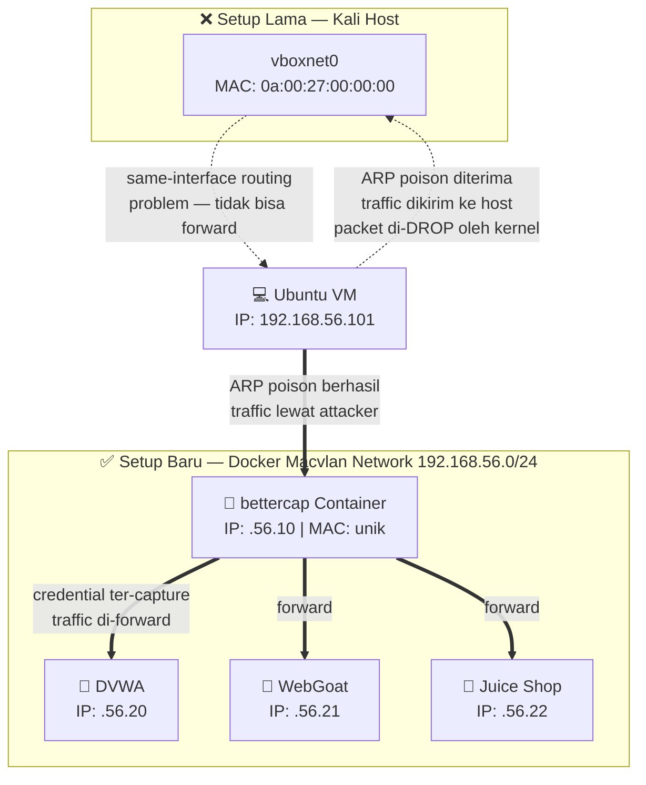
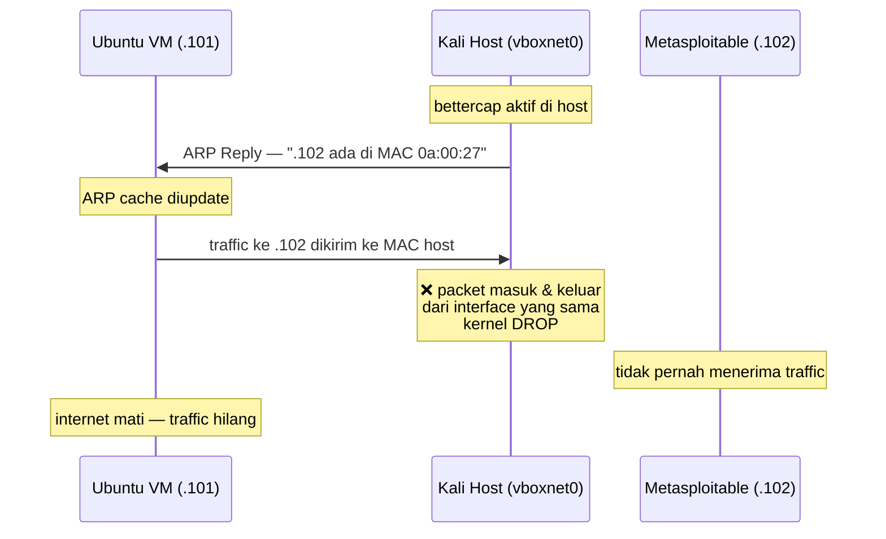
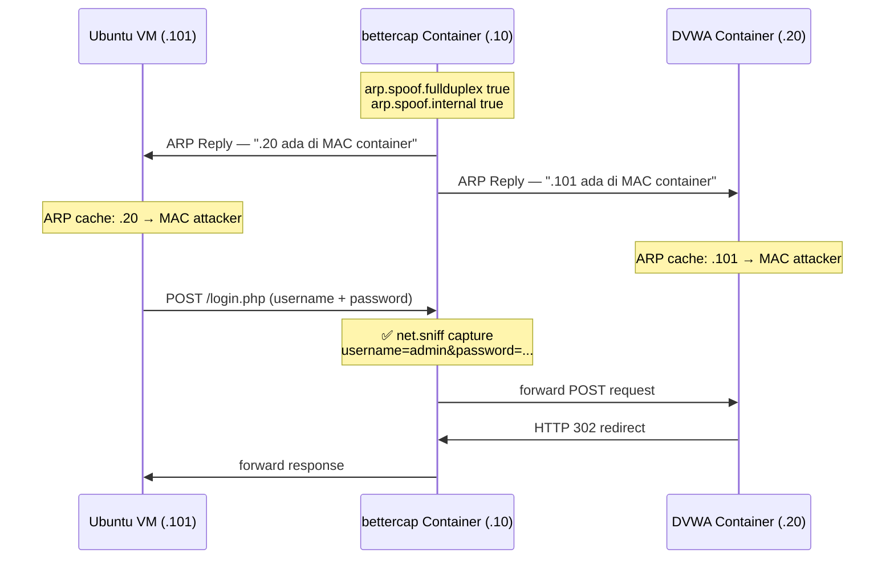
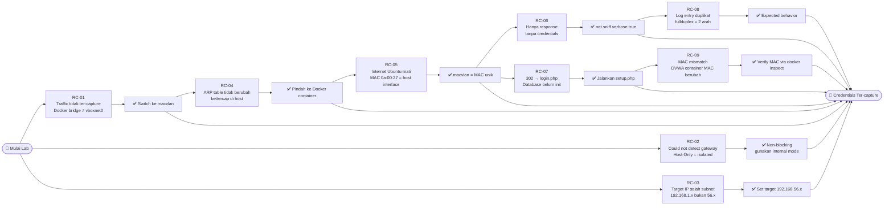
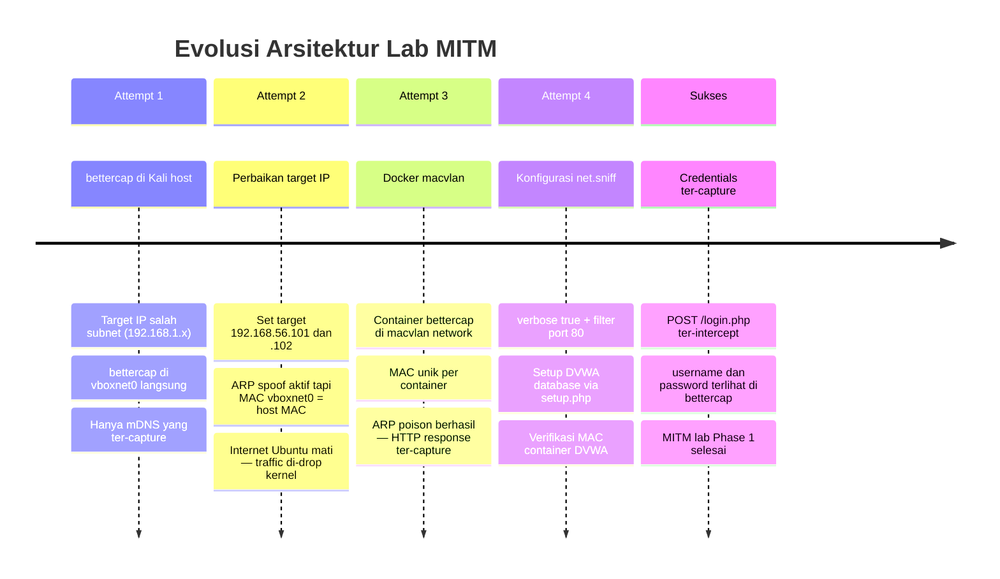
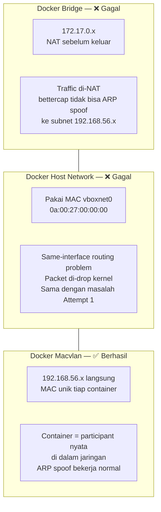
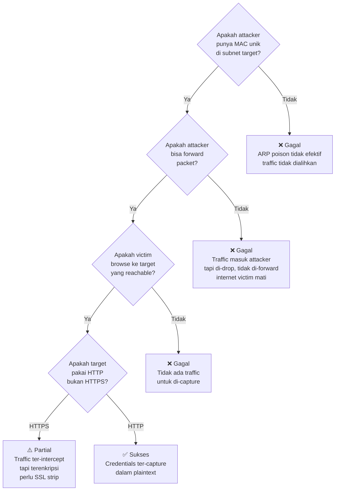

# 🔍 Root Cause Analysis (RCA) — Core Challenges

Dokumen ini mencatat masalah arsitektural dan operasional utama yang dipecahkan selama pembangunan lab simulasi MITM (*Man-in-the-Middle*).

---

## 1. Visualisasi Solusi Jaringan (Host vs Macvlan)

Di bawah ini adalah diagram arsitektur yang menunjukkan mengapa *spoofer* yang dijalankan di *Host* gagal, dan mengapa Docker Macvlan berhasil menjadi solusi.

---

## 2. Alur Kegagalan — Kenapa Host Tidak Bisa Jadi MITM

---

## 3. Alur Sukses — Docker Macvlan MITM

---

## 4. Root Cause Map — Semua 9 Obstacle

---

## 5. Timeline Perubahan Arsitektur

---

## 6. Perbandingan Network Driver

---

## 7. Decision Tree — Kapan ARP Spoof Berhasil

